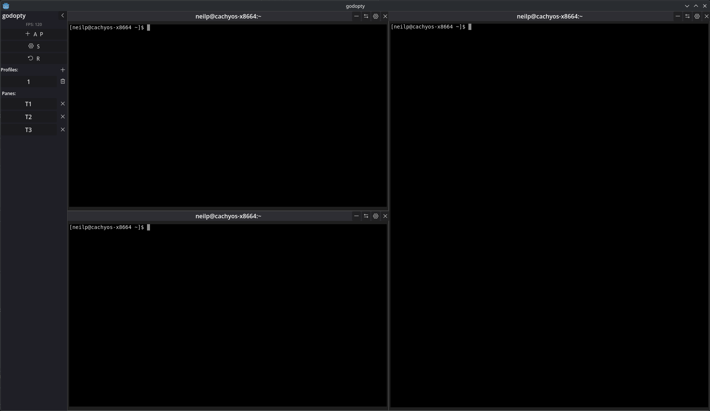

First release!

<!--more-->

**Terminal engine**

- `godopty-core` handles PTY spawning via `portable-pty`
- ANSI parsing via `vte`
- A full terminal grid via `alacritty_terminal`. 
- Damage-tracked rendering keeps the Godot frontend fast.

**Tiling grid**

- Split panes vertically or horizontally inside nested `SplitContainer` nodes.
- Four pane types: terminal, code viewer (`CodeEdit`), file tree, and observer.
- `Alt+Arrow` navigates between panes geographically.

**Concept engine.**
- Define regex triggers that match terminal output and inject commands into labelled panes.
- Two capture modes: `SingleLine` broadcasts immediately, `UntilStop` buffers command output and routes it to receiver panes.
- Default concepts ship for 'cat' and port conflicts.

**Profiles and persistence.** 

- Save terminal layouts as named profiles.
- Settings, profiles, and layout state auto-save to `user://`.
- Everything persists across restarts.

**Release**

- Download the standalone binary for your platform from [GitHub Releases](https://github.com/godopty/godopty/releases/tag/v0.1.0).
- Changelog: [github.com/godopty/godopty/CHANGELOG](https://github.com/godopty/godopty/blob/main/CHANGELOG.md).
- Source: [github.com/godopty/godopty](https://github.com/godopty/godopty).
